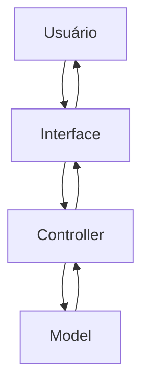
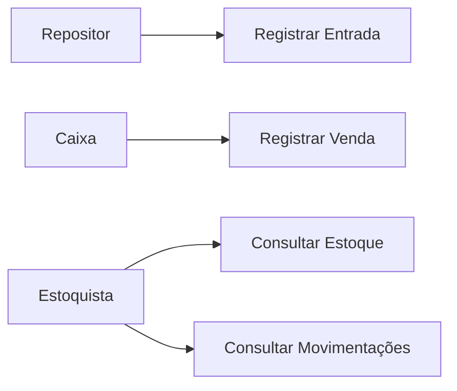
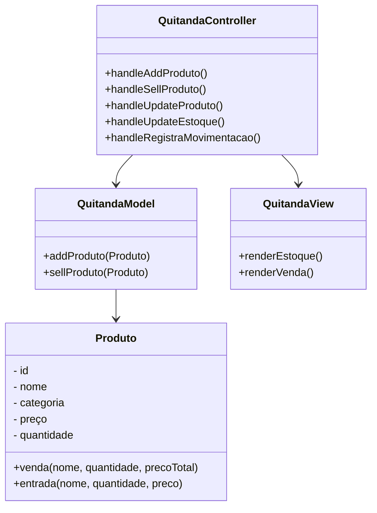
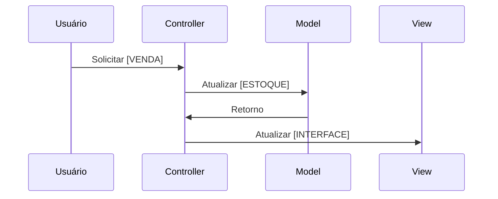

# Documentação de Especificações de Requistos de Software (SRS)

## Sistema de Gestão de Quitanda (Quitanda MVC)

**Padrão Internacional:** ISO/IEC/IEEE 29148:2018
**Versão:** 1.0.0
**Data:** 2026-04-14
**Autor:** Rian Eduardo

---

## 1. Introdução

### 1.1 Propósito

Este Documento descreve os requisitos do sistema **Quitanda MVC**, com o objetivo de:

* Definir funcionalidade
* Padronizar entendimentos entre os stakeholders
* Servir como base para desenvolvimento e teste

---

### 1.2 Escopo

O Sistema permitirá:

* Registro de entrada de Produtos
* Controle de Estoque
* Registro de Vendas
* Visualização dos Histórico das Movimentações

O Sistema será uma aplicação web front-end utilizando:

* HTML
* CSS
* JavaScript
* Arquitetura MVC
* Estrutura POO

Objetivos:

---

### 1.3 Definições e Acrônimos

Tabela de Termos e Definições

| Termos | Definições |
| - | - |
| Produto | Item comercializado na Quitanda |
| Entrada | Registro de chegada de Produto |
| Saída | Registro de venda de Produto |
| Estoque | Quantidade disponível de Produtos |

Lista de Acrônimos

* **SGQ:** Sistema de Gestão de Quitanda
* **RF:** Requisitos Funcionais
* **RNF:** Requisitos Não Funcionais
* **UC:**  Casos de Uso
* **CA:** Critérios de Aceitação

### 1.4 Visão Geral do Documento

Este Documento está Organizado em:

* Introdução e Visão Geral
* Descrição do Sistema
* Requistos Detalhados
* Modelos UML
* Regras de Negócio

---

## 2. Descrição Geral do Sistema

### 2.1 Perspectiva do Sistema

O Sistema é standalone (front-end), operando em um navegador web.

---

### 2.2 Funções do Sistema

O Sistema deve:

* Cadastrar Produtos
* Atualizar Estoque
* Registrar Vendas
* Validar Operações
* Exibir Dados
  
---

### 2.3 Classes de Usuários

| Usuários | Descrição |
| - | - |
| Estoquista | Gerenciar estoque |
| Caixa | Realizar Venda |
| Repositor | Registrar Entradas |

---

### 2.4 Ambiente Operacional

* Navegadores Web (Chrome, Edge, Firefox, Brave)

---

### 2.5 Restrições

* Não utiliza Banco de Dados
* Dados aramazenado na memória
* Sem autenticação

---

### 2.6 Suposições

* Usuário possui conhecimento de Informática
* Volume de dados é pequeno

---

## 3. Requisitos do Sistema

### 3.1 Requisitos Funcionais

#### RF-01 [Cadastro de Produtos]
**Descrição:** Permitir cadastrar um produto
* **Prioridade:** Alta
* **Versão:** 1.0
* **Data:** 2026-04-28
* **Rastreabilidade:** Necessidade do Stakeholder 01

**Critérios de Aceitação:** 

**[]** - Entrada de Dados: Nome | Categoria | Preço | Quantidade

**[]** - Validação dos Campos

**[]** - Verificação de Duplicidade

**[]** - Saída: Notificação para o Usuário

#### RF-02 [Atualizar Estoque]
**Descrição:** Permitir atualização de dados de Produtos já existentes
* **Prioridade:** Alta
* **Versão:** 1.0
* **Data:** 2026-04-28
* **Rastreabilidade:** Necessidade do Stakeholder 02

**Critérios de Aceitação:** 

**[]** - Entrada de Dados: Nome | Categoria | Preço | Quantidade

**[]** - Verificar se o Produto já está cadastrado

**[]** - Validação dos Campos

**[]** - Verificação de Duplicidade

**[]** - Saída: Notificação para o Usuário

#### RF-03 [Listagem de Estoque]
**Descrição:** Exibir as informações dos Produtos já cadastrados
* **Prioridade:** Alta
* **Versão:** 1.0
* **Data:** 2026-04-28
* **Rastreabilidade:** Necessidade do Stakeholder 03

**Critérios de Aceitação:** 

**[]** - Listagem de Produtos

**[]** - Saída: ID | Nome | Categoria | Preço | Quantidade

#### RF-04 [Registro de Vendas]
**Descrição:** Permitir a venda de Produtos
* **Prioridade:** Alta
* **Versão:** 1.0
* **Data:** 2026-04-28
* **Rastreabilidade:** Necessidade do Stakeholder 04

**Critérios de Aceitação:** 

**[]** - Venda de Produtos cadastrados

**[]** - Verificação de Quantidade

**[]** - Atualização de Estoque

**[]** - Saída: Notificação para o Usuário

#### RF-05 [Histórico de Movimentações]
**Descrição:** Permitir o registro de entradas (Entrada/Saída) de Produtos
* **Prioridade:** Média
* **Versão:** 1.0
* **Data:** 2026-04-28
* **Rastreabilidade:** Necessidade do Stakeholder 05

**Critérios de Aceitação:** 

**[]** - Registro de Movimentações em uma lista

**[]** - Consulta das Movimentações

**[]** - Verificação de Duplicidade

**[]** - Saída: Notificação para o Usuário

### 3.2 Requisitos Não-Funcionais

#### RNF-01 [Usabilidade]
**Descrição:** Interface Simples e Intuitiva

#### RNF-02 [Desempenho]
**Descrição:** Respostas Rápidas e Inferiores a 1s

#### RNF-03 [Usabilidade]
**Descrição:** Interface Simples e Intuitiva

#### RNF-003: [Arquitetura de Software MVC]
**Descrição:** Estrutura da Arquitetura de Códigos em Padrão MVC(Model, View, Controller)

#### RNF-004: [Confiabilidade]
**Descrição:** Validação de Entrada e Dados (OBRIGATÓRIO)

---

## 4 Regras do Negócio

Tabela de Regras
|Regras de Negócio|Descrição|
|-|-|
| RN-01 | Quantidade de produtos não pode ser negativa |
| RN-02 | Preço do Porduto não pode ser Negativo |
| RN-03 | Venda so pode ser realizada se estoque for suficiente |
| RN-04 | Toda Movimentação deve ser Registrada |

Pode Existir Restrições para o Negócio (legais, locais ...)

---

## 5. Modelos do Sistema

### 5.1 Diagrama de Casos de Uso

Diagrama de Casos de Uso: O que o sistema deve fazer do ponto de vista do Usuário

---

### 5.2 Diagrama de Classes UML

Diagrama de Classes UML: Estrutura do código, classes, atributos e métodos

---

### 5.3 Diagrama de Sequência

Diagrama de Sequência: Interação entre objetos ao longo do tempo, para realizar uma funcionalidade específica

#### 5.3.1 Venda

## 6. Matriz de Análise de Risco

| Risco | Impacto | Mitigação |
| ----- | ------- | --------- |
| Perda de Dados | **Alta** | Uso de LocalStorage/DB (Persistência de Dados) |
| Entrada de Dados | **Médio** | Validação de entradas |

---

## 7. Controle de Versões

### 7.1 Histórico de Alterações

| Versão | Data | Autor | Modificações |
| - | - | - | - |
| 1.0.0 | 2026-04-28 | @rianeduardo | Init

### 7.2 Aprovações

| Papel | Nome | Data | Assinatura |
| - | - | - | - |
| Stakeholder | José Joaquim | 2026-04-28 | [ASS.] 